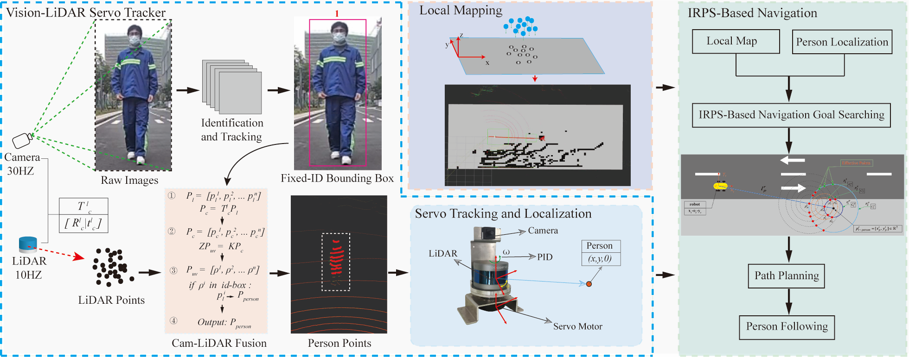

# Auto-Follower
**A person-following framework for urban Ackermann human-machine collaborative robotics. Auto-Follower comprises three main modules: Vision-LiDAR Servo Tracker (VLST), local mapping, and a navigation module based on the Iterative Radius Points Search(IRPS) method. Experiments in both urban environments and laboratories have been conducted to validate the effectiveness of our framework. The results demonstrate that our proposed framework, with its superior perception capabilities, achieves robust person-following performance and generalizes well across different robot types and application scenarios. A video of the demonstration of the method can be found on [YouTube](https://www.youtube.com/watch?v=xQaiPCszXCA).**

## Menu
- [**System Overview**](#system-overview)
- [**Package install**](#install)
- [**Run the package**](#run-the-package)

## System Overview
<p align='center'>
    
</p>

The main contributions of our work can be summarized as follows:  
•	A novel person-following framework for urban human-robot collaboration, integrating VLST, local mapping, and IRPS-based navigation.   
•	A VLST module that fuses camera and LiDAR data to achieve 360-degree person identification and localization.  
•	An IRPS-based navigation method designed to dynamically determine obstacle-free navigation goals, ensuring safe and efficient path planning.  


## Install
Use the following commands to download and compile the package.

```
cd ~/catkin_ws/src
git clone https://github.com/oooay/Auto-Follower.git
cd ..
catkin_make
```

## Run the package
**1. Run the sensor drivers launch file:**  
```
roslaunch yhs_can_control yhs_can_control.launch  
roslaunch rslidar_sdk start.launch  
roslaunch usb_cam usb_cam.launch  
roslaunch visual_follow_motor visual_follow_motor.launch  
```
**2. Person Identification and Localization**  
```
roslaunch tracker track_main.launch  
roslaunch hybrid_astar path_planning_new.launch  
```
**3. Local mapping and IRPS-based path navigation** 
```
roslaunch linefit_ground_segmentation_ros segmentation.launch  
roslaunch visual_follow_mapping visual_follow_mapping.launch  
roslaunch hybrid_astar path_planning.launch  
rosrun hybrid_astar path_tracking_purepursuit.py  
```
